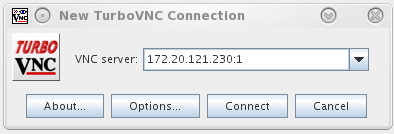
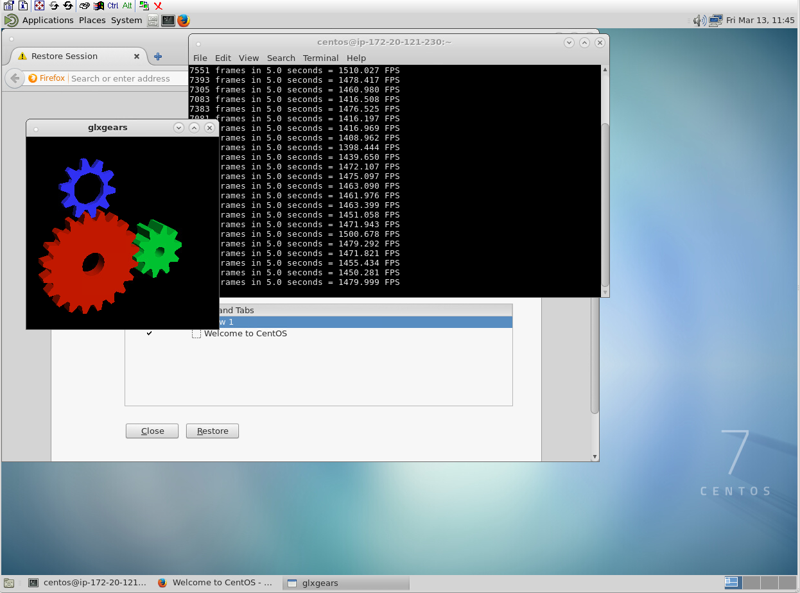

# GPU Accelerated Linux Cloud Desktop 
As part of my day job I've been looking into running OpenGL capable Linux based cloud desktops. Currently it seems
no vendor offers this as a solution (Amazon appears to be working on it) so I had to roll my own.

I'm hoping this will be useful to someone, and I hope the open source community can build on this work to make something awesome!

## How to use this script
### Start a g2.2xlarge EC2 instance
First spin up an amazon GPU instance. Use the latest Centos 7 AMI - ami-e4ff5c93


Make sure you expose ports 5801 and 5901 to incoming traffic in your security group.

### Run the script
Wait for it to finish booting, then run the setup-desktop.sh script on your client machine (NOT the EC2 instance) with the following arguements:

```
./setup-desktop.sh <private key location> <ec2 username> <hostname/ip> <vnc password>
```

eg:

```
./setup-desktop.sh ~/.ssh/amazon-key.pem centos 172.20.121.27 jdsflk24
```

The vnc password should be 8 letters (this is a limitation of the software, you can secure your instance in other ways if you play
around with the vnc settings and the AWS firewall settings).

The script will run, and reboot the machine several times. Don't worry that the NVIDIA driver fails to install the first time around,
that's normal! The whole process can take 5-20 minutes.

### Log in!
Once the script is finished, you'll get the command prompt back. Now you can navigate in a web browser to the IP address (or hostname
if you've set it up) of your cloud instance on port 5801. This will load the javascript based VNC viewer (you can connect using TurboVNC client
too, but connecting through your browser is cool right? ;)).


Change the hostname in the box to something that's actually resolvable (if in doubt, use the ip address) and add :1 at the end (this is the
VNC display number)



### Run 
Now your MATE desktop will load, to get OpenGL applications to run you need to start a second X Server which VirtualGL uses to talk to
the NVIDIA gpu. 
Type ```sudo xinit &``` in a terminal.

To run any OpenGL applications, you need to wrap them in VirtualGL, this will divert the OpenGL calls to the remote GPU rather than
your client machine(!) To do this type
```/opt/VirtualGL/bin/vglrun <application>```

For example here's glxgears:

```/opt/VirtualGL/bin/vglrun glxgears```



Now go install Blender or Maya and get to work!

## Future Work

* Have the desktop announce itself as a service to consul (or etcd or your favourite flavour of service discovery).
* Test running as a service on a Mesos cluster.
* Package up as an AMI/Docker container (not sure how viable running X servers in Docker is from initial attempts)

